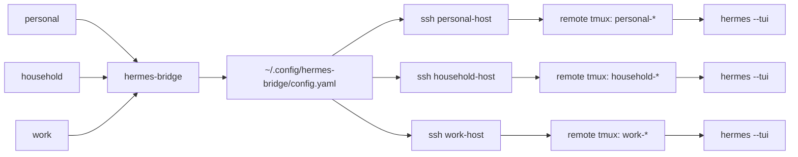

# Hermes Bridge

<p align="center">
  
</p>

**Hermes Bridge** gives a fleet of remote [Hermes Agent](https://hermes-agent.nousresearch.com/) workspaces one local command surface. It solves two practical problems that show up once your agents represent different trust boundaries, not just different prompts:

1. **Boundary-aware multi-agent control.** `personal`, `household`, and `work` agents may need different SSH accounts, home directories, auth scopes, inboxes, prompts, and may even live on entirely separate physical machines. They should still feel like one product, not three copied shell scripts that drift over time.
2. **Fragile SSH sessions.** Long-running agent work should survive a laptop sleep, Wi-Fi drop, VPN change, or broken SSH connection. The remote TUI runs inside `tmux`, so you can reconnect and reattach instead of losing the session.

The core idea is deliberately boring:

```text
one generic implementation + private agent config + tiny command shims + remote tmux
```

So these can all be the same executable with different config stanzas:

```text
personal  -> hermes-bridge
household -> hermes-bridge
work      -> hermes-bridge
```

When invoked through a symlink, Hermes Bridge detects the command name (`argv[0]`) and loads the matching agent stanza from your local config. The config lives outside the public repo, so the generic launcher can be open sourced without leaking personal paths, SSH aliases, Drive conventions, or prompt templates.

---

## Why this exists

Hermes Bridge is for people who run specialized remote agents that should stay separated: personal life, shared household/family context, employer work, client work, or any other boundary where mixing files, memories, credentials, or prompts would be sloppy.

### 1. Uniform control for multiple agents

A multi-agent Hermes setup usually starts with one private agent:

```bash
personal
```

Then a shared household/family agent appears:

```bash
household
```

Then a work agent appears with different credentials and context:

```bash
work
```

If each command is a separate copied script, feature drift is guaranteed. A tmux fix lands in one script but not another. Upload behavior grows in one place. Session browsing diverges. Eventually every small improvement becomes five edits.

Hermes Bridge centralizes the behavior while keeping agent-specific facts in config. The same interface works across agents:

```bash
personal tmux list
household tmux list
work tmux list

personal sessions browse
household sessions browse
work sessions browse
```

### 2. Remote sessions that survive laptop disconnects

SSH is a transport, not a durable workspace. If the Hermes TUI lives directly inside your laptop's SSH session, closing the laptop or dropping network can kill the work surface you were using.

Hermes Bridge starts Hermes inside a named `tmux` session on the remote host. Your laptop can disconnect; the remote session keeps running. Later you reconnect and attach, browse, capture, or kill sessions through the same agent command:

```bash
personal new planning       # starts remote Hermes TUI inside tmux
# laptop sleeps, network drops, SSH disconnects
personal tmux attach planning
personal tmux capture planning
```

The result is a small local control plane for remote agent work: one command model, many agents, persistent remote sessions.



---

## Design goals

- **One implementation.** Fix tmux/session/upload behavior once.
- **Uniform agent interface.** Every configured agent exposes the same command grammar where its capabilities are enabled.
- **Persistent remote workspaces.** Start Hermes inside remote `tmux` so agent TUIs can outlive laptop sleep, network drops, and SSH disconnects.
- **Private config.** No personal SSH aliases, paths, Drive roots, or prompt templates in the public repo.
- **Symlink dispatch.** `work tmux list` is equivalent to `hermes-bridge work tmux list`.
- **Capability-gated agents.** One agent can have book uploads while another exposes only TUI/session commands.
- **Open-sourceable core.** The generic repo contains examples, not your real config.
- **No hidden system mutation.** Installs are user-local by default (`~/.local/bin`).
- **Shell-safe remote command construction.** Remote commands are quoted with Python's `shlex` before crossing SSH.

---

## Quick start

Install from source for development:

```bash
git clone <repo-url> hermes-bridge
cd hermes-bridge
python3 -m pip install -e .
```

Create a private config:

```bash
mkdir -p ~/.config/hermes-bridge
cp examples/config.example.yaml ~/.config/hermes-bridge/config.yaml
$EDITOR ~/.config/hermes-bridge/config.yaml
```

Create the canonical command plus agent shims:

```bash
hermes-bridge install
```

Then use either style:

```bash
hermes-bridge personal tmux list
personal tmux list
```

---

## Command model

### Start or resume remote TUI sessions

A bare agent command creates a remote `tmux` session and attaches to it. Named sessions make it easy to disconnect from one machine and reattach later from another.

```bash
personal                         # start a new remote Hermes TUI inside tmux
personal new planning            # named tmux session
personal new docs -- --skills google-workspace
```

### Manage remote tmux sessions

```bash
personal tmux list
personal tmux browse
personal tmux attach 1
personal tmux capture personal-planning
personal tmux kill personal-planning --force
```

### Browse/resume Hermes saved sessions

```bash
personal sessions list
personal sessions browse
personal sessions resume 20260625_abc123
personal sessions continue
```

### Upload files when configured

```bash
personal upload ~/Desktop/screenshot.png -- "what is this?"
personal upload-book ~/Downloads/book.epub -- "extract the key ideas"

work upload ~/Desktop/report.pdf -- "summarize risks and follow-ups"
```

Multiple files are supported. Shell-expanded globs and explicit multi-file lists are treated as one batch: Bridge uploads each file, uploads a Markdown manifest listing every remote path, then starts a single durable manifest task.

```bash
personal upload 2026-07-03-*.jpg -- "review this photo batch"
personal upload ~/Desktop/a.jpg ~/Desktop/b.jpg --name photo-review -- "compare these two"
```

Message text must go after `--`; all non-option arguments before `--` are interpreted as local file paths or glob patterns.

### Validate setup

```bash
hermes-bridge config validate
hermes-bridge doctor --all --no-remote
hermes-bridge doctor personal
```

---

## Configuration

Hermes Bridge reads:

```text
$HERMES_BRIDGE_CONFIG
```

if set, otherwise:

```text
~/.config/hermes-bridge/config.yaml
```

Minimal example:

```yaml
defaults:
  remote_term: xterm-256color
  remote_shell: bash
  # Resolve tmux through PATH instead of hard-coding Homebrew, apt, Nix, etc.
  remote_tmux_cmd: tmux
  # This is prepended to the remote process PATH, before the existing remote PATH.
  # User-local tools win when present; platform package-manager paths work otherwise.
  remote_path_prepend:
    - "{remote_home}/.local/bin"
    - "{remote_home}/bin"
    - /opt/homebrew/bin              # macOS Apple Silicon Homebrew
    - /home/linuxbrew/.linuxbrew/bin # Linuxbrew, if used
    - /usr/local/bin
    - /usr/bin
    - /bin
  tmux_geometry: 120x40

agents:
  work:
    command: work
    display_name: Work Agent
    ssh_alias: work-host
    remote_user: hermes-work
    remote_home: /home/hermes-work
    remote_hermes_cmd: /home/hermes-work/.local/bin/hermes
    docs_prefix: "WORK:"
    drive_root: "Work/"
    tmux:
      enabled: true
      prefix: work
    sessions:
      enabled: true
    upload:
      file:
        enabled: true
        remote_inbox: /home/hermes-work/Inbox/_Inbox
        prompt_template: work-upload-file.md
```

### Dependency resolution

Hermes Bridge treats `tmux` as a remote dependency, not as something the bridge
should silently install or symlink. The open-source default is:

```yaml
remote_tmux_cmd: tmux
remote_path_prepend:
  - "{remote_home}/.local/bin"
  - "{remote_home}/bin"
  - /opt/homebrew/bin
  - /home/linuxbrew/.linuxbrew/bin
  - /usr/local/bin
  - /usr/bin
  - /bin
```

The bridge prepends those entries to the remote process `PATH` and then runs
`tmux`. That means a real user-local install wins when present, while ordinary
platform installs from Homebrew, apt/dnf/pacman, Linuxbrew, Nix-provided PATHs,
or system `/usr/bin` installs can work without changing bridge code.

If your environment needs an absolute binary, set `remote_tmux_cmd` explicitly
for that config. For normal portable configs, prefer PATH resolution and use
`doctor` to see both the configured command and the resolved remote binary.

### Tmux status bar styling

Hermes Bridge applies a small per-session tmux status-bar theme after creating
a session. If an agent does not configure a style, the built-in defaults stay
unchanged:

```yaml
tmux:
  enabled: true
  prefix: work
```

To customize one agent without touching that remote user's `~/.tmux.conf`, add
a `tmux.style` mapping. The MVP supports the same subset of tmux options that
Hermes Bridge sets by default:

```yaml
tmux:
  enabled: true
  prefix: work
  style:
    status-position: bottom
    status-style: "bg=#1d2021,fg=#ebdbb2"
    status-left-style: "bg=#1d2021,fg=#fabd2f"
    status-right-style: "bg=#1d2021,fg=#fabd2f"
    window-status-current-style: "bg=#1d2021,fg=#fabd2f"
    message-style: "bg=#d79921,fg=#282828,bold"
    pane-active-border-style: "fg=#d79921"
    status-left: " Work | #S "
    status-right: " %H:%M "
```

Supported keys: `status-position`, `status-style`, `status-left-style`,
`status-right-style`, `window-status-current-style`, `message-style`,
`pane-active-border-style`, `status-left`, and `status-right`. Underscore
aliases such as `status_right` are accepted and normalized to tmux's hyphenated
option names. Quote values containing `#`, because YAML treats an unquoted `#`
after whitespace as a comment marker.

### Capability blocks

Feature availability is controlled by config blocks:

```yaml
agents:
  household:
    command: household
    # ...
    tmux:
      enabled: true
      prefix: household
    sessions:
      enabled: true
```

The household agent has no `upload.file` block, so this fails cleanly:

```bash
household upload foo.png
# household: capability not configured/enabled: upload.file
```

Another agent can enable book upload without forking code:

```yaml
agents:
  personal:
    upload:
      book:
        enabled: true
        remote_inbox: /home/hermes-primary/Books/_Inbox
        prompt_template: personal-upload-book.md
```

That is the central maintenance win: the code knows how to upload; config decides which agents expose upload and how it is wired.

---

## Symlink dispatch

Given:

```bash
ln -s ~/.local/bin/hermes-bridge ~/.local/bin/work
```

running:

```bash
work tmux list
```

is equivalent to:

```bash
hermes-bridge work tmux list
```

The symlink is just a human-friendly partial application of the first argument. Configuration remains external.

Wrapper mode is also supported for environments where symlinks are undesirable:

```bash
hermes-bridge link --all --mode wrapper
```

---

## Private config repo pattern

Recommended split:

```text
~/work/projects/hermes-bridge/            # public/open-sourceable code
~/work/private/hermes-bridge-config/      # private config + templates
```

The public repo ships examples only:

```text
examples/config.example.yaml
```

Your real config and prompt templates belong in the private repo and can be pointed to with:

```bash
export HERMES_BRIDGE_CONFIG=~/work/private/hermes-bridge-config/config.yaml
```

or copied/symlinked into:

```text
~/.config/hermes-bridge/config.yaml
```

---

## Security model

Hermes Bridge does **not** copy credentials, OAuth tokens, `.env` files, or Hermes profiles. It only starts remote commands over SSH using the agent account already configured on the target host.

It should not need sudo. Default install/link operations write only under:

```text
~/.local/bin
```

Keep these out of public repos:

- real SSH hostnames/aliases if sensitive;
- real remote usernames if sensitive;
- upload prompt templates with personal/business instructions;
- Drive folder conventions if private;
- any `.env`, token, OAuth, or auth-context files.

---

## Development

Run tests with stdlib `unittest`:

```bash
PYTHONPATH=src python3 -m unittest discover -s tests
```

Run the dev wrapper:

```bash
./bin/hermes-bridge --help
```

Validate a specific config:

```bash
./bin/hermes-bridge --config /path/to/config.yaml config validate
```

---

## Status

Hermes Bridge is intentionally small and boring. It is a control-plane utility: most runtime is spent in SSH, tmux, and Hermes itself. Python startup overhead and the GIL are irrelevant for this workload.
