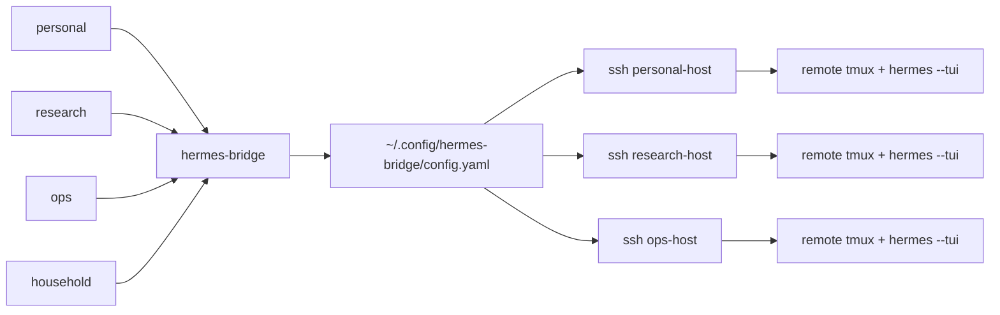

# Hermes Bridge

**Hermes Bridge** is a config-driven local launcher for remote [Hermes Agent](https://hermes-agent.nousresearch.com/) workspaces. It replaces one-off per-agent shell scripts with one reusable command plus private local configuration.

The core idea is deliberately boring:

```text
one generic implementation + private agent config + tiny command shims
```

So these can all be the same executable:

```text
personal  -> hermes-bridge
research  -> hermes-bridge
ops       -> hermes-bridge
household -> hermes-bridge
```

When invoked through a symlink, Hermes Bridge detects the command name (`argv[0]`) and loads the matching agent stanza from your local config. The config lives outside the public repo, so the generic launcher can be open sourced without leaking personal paths, SSH aliases, Drive conventions, or prompt templates.

---

## Why this exists

A multi-agent Hermes setup usually starts with one convenience script:

```bash
personal
```

Then another agent appears:

```bash
research
```

Then another:

```bash
ops
```

If each command is a separate copied script, feature drift is guaranteed. A tmux fix lands in one script but not another. Upload behavior grows in one place. Session browsing diverges. Eventually every small improvement becomes five edits.

Hermes Bridge centralizes the behavior while keeping agent-specific facts in config.



---

## Design goals

- **One implementation.** Fix tmux/session/upload behavior once.
- **Private config.** No personal SSH aliases, paths, Drive roots, or prompt templates in the public repo.
- **Symlink dispatch.** `ops tmux list` is equivalent to `hermes-bridge ops tmux list`.
- **Capability-gated agents.** One agent can have book uploads while another exposes only TUI/session commands.
- **Open-sourceable core.** The generic repo contains examples, not your real config.
- **No hidden system mutation.** Installs are user-local by default (`~/.local/bin`).
- **Shell-safe remote command construction.** Remote commands are quoted with Python's `shlex` before crossing SSH.

---

## Quick start

Install from source for development:

```bash
git clone <repo-url> hermes-bridge
cd hermes-bridge
python3 -m pip install -e .
```

Create a private config:

```bash
mkdir -p ~/.config/hermes-bridge
cp examples/config.example.yaml ~/.config/hermes-bridge/config.yaml
$EDITOR ~/.config/hermes-bridge/config.yaml
```

Create the canonical command plus agent shims:

```bash
hermes-bridge install
```

Then use either style:

```bash
hermes-bridge personal tmux list
personal tmux list
```

---

## Command model

### Start or resume remote TUI sessions

```bash
personal                         # start a new remote Hermes TUI inside tmux
personal new planning            # named tmux session
personal new docs -- --skills google-workspace
```

### Manage remote tmux sessions

```bash
personal tmux list
personal tmux browse
personal tmux attach 1
personal tmux capture personal-planning
personal tmux kill personal-planning --force
```

### Browse/resume Hermes saved sessions

```bash
personal sessions list
personal sessions browse
personal sessions resume 20260625_abc123
personal sessions continue
```

### Upload files when configured

```bash
personal upload ~/Desktop/screenshot.png "what is this?"
personal upload-book ~/Downloads/book.epub "extract the key ideas"

ops upload ~/Desktop/orders.csv "summarize operational risks"
```

Legacy flags like `--upload` and `--upload_book` are intentionally not part of the new interface. Use explicit subcommands.
The older `upload file <path>` and `upload book <path>` forms remain supported for compatibility, but new configs should prefer `upload <path>` for ordinary files and expose `upload-book <path>` only for agents that enable the optional `upload.book` capability.

### Validate setup

```bash
hermes-bridge config validate
hermes-bridge doctor --all --no-remote
hermes-bridge doctor personal
```

---

## Configuration

Hermes Bridge reads:

```text
$HERMES_BRIDGE_CONFIG
```

if set, otherwise:

```text
~/.config/hermes-bridge/config.yaml
```

Minimal example:

```yaml
defaults:
  remote_term: xterm-256color
  remote_shell: bash
  # Resolve tmux through PATH instead of hard-coding Homebrew, apt, Nix, etc.
  remote_tmux_cmd: tmux
  # This is prepended to the remote process PATH, before the existing remote PATH.
  # User-local tools win when present; platform package-manager paths work otherwise.
  remote_path_prepend:
    - "{remote_home}/.local/bin"
    - "{remote_home}/bin"
    - /opt/homebrew/bin              # macOS Apple Silicon Homebrew
    - /home/linuxbrew/.linuxbrew/bin # Linuxbrew, if used
    - /usr/local/bin
    - /usr/bin
    - /bin
  tmux_geometry: 120x40

agents:
  ops:
    command: ops
    display_name: Ops Agent
    ssh_alias: ops-host
    remote_user: hermes-ops
    remote_home: /home/hermes-ops
    remote_hermes_cmd: /home/hermes-ops/.local/bin/hermes
    docs_prefix: "OPS:"
    drive_root: "Ops/"
    tmux:
      enabled: true
      prefix: ops
    sessions:
      enabled: true
    upload:
      file:
        enabled: true
        remote_inbox: /home/hermes-ops/Inbox/_Inbox
        prompt_template: ops-upload-file.md
```

### Dependency resolution

Hermes Bridge treats `tmux` as a remote dependency, not as something the bridge
should silently install or symlink. The open-source default is:

```yaml
remote_tmux_cmd: tmux
remote_path_prepend:
  - "{remote_home}/.local/bin"
  - "{remote_home}/bin"
  - /opt/homebrew/bin
  - /home/linuxbrew/.linuxbrew/bin
  - /usr/local/bin
  - /usr/bin
  - /bin
```

The bridge prepends those entries to the remote process `PATH` and then runs
`tmux`. That means a real user-local install wins when present, while ordinary
platform installs from Homebrew, apt/dnf/pacman, Linuxbrew, Nix-provided PATHs,
or system `/usr/bin` installs can work without changing bridge code.

If your environment needs an absolute binary, set `remote_tmux_cmd` explicitly
for that config. For normal portable configs, prefer PATH resolution and use
`doctor` to see both the configured command and the resolved remote binary.

### Capability blocks

Feature availability is controlled by config blocks:

```yaml
agents:
  research:
    command: research
    # ...
    tmux:
      enabled: true
      prefix: research
    sessions:
      enabled: true
```

The research agent has no `upload.file` block, so this fails cleanly:

```bash
research upload foo.png
# research: capability not configured/enabled: upload.file
```

Another agent can enable book upload without forking code:

```yaml
agents:
  personal:
    upload:
      book:
        enabled: true
        remote_inbox: /home/hermes-primary/Books/_Inbox
        prompt_template: personal-upload-book.md
```

That is the central maintenance win: the code knows how to upload; config decides which agents expose upload and how it is wired.

---

## Symlink dispatch

Given:

```bash
ln -s ~/.local/bin/hermes-bridge ~/.local/bin/ops
```

running:

```bash
ops tmux list
```

is equivalent to:

```bash
hermes-bridge ops tmux list
```

The symlink is just a human-friendly partial application of the first argument. Configuration remains external.

Wrapper mode is also supported for environments where symlinks are undesirable:

```bash
hermes-bridge link --all --mode wrapper
```

---

## Private config repo pattern

Recommended split:

```text
~/work/projects/hermes-bridge/            # public/open-sourceable code
~/work/private/hermes-bridge-config/      # private config + templates
```

The public repo ships examples only:

```text
examples/config.example.yaml
```

Your real config and prompt templates belong in the private repo and can be pointed to with:

```bash
export HERMES_BRIDGE_CONFIG=~/work/private/hermes-bridge-config/config.yaml
```

or copied/symlinked into:

```text
~/.config/hermes-bridge/config.yaml
```

---

## Security model

Hermes Bridge does **not** copy credentials, OAuth tokens, `.env` files, or Hermes profiles. It only starts remote commands over SSH using the agent account already configured on the target host.

It should not need sudo. Default install/link operations write only under:

```text
~/.local/bin
```

Keep these out of public repos:

- real SSH hostnames/aliases if sensitive;
- real remote usernames if sensitive;
- upload prompt templates with personal/business instructions;
- Drive folder conventions if private;
- any `.env`, token, OAuth, or auth-context files.

---

## Development

Run tests with stdlib `unittest`:

```bash
PYTHONPATH=src python3 -m unittest discover -s tests
```

Run the dev wrapper:

```bash
./bin/hermes-bridge --help
```

Validate a specific config:

```bash
./bin/hermes-bridge --config /path/to/config.yaml config validate
```

---

## Status

Hermes Bridge is intentionally small and boring. It is a control-plane utility: most runtime is spent in SSH, tmux, and Hermes itself. Python startup overhead and the GIL are irrelevant for this workload.
